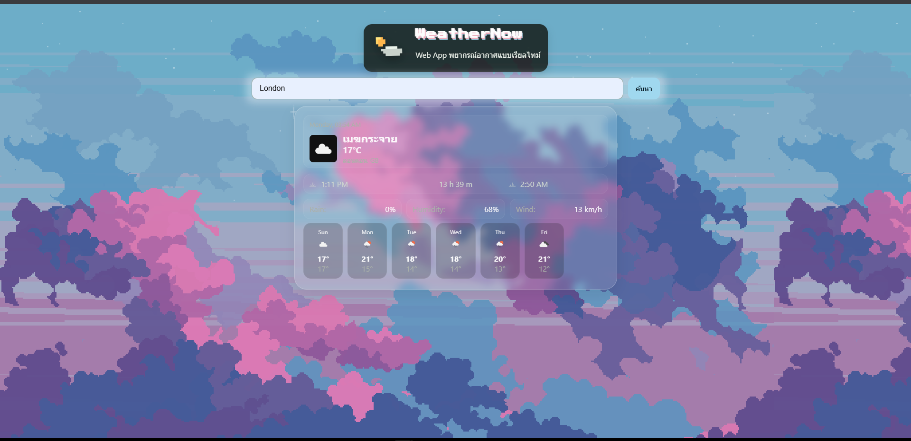
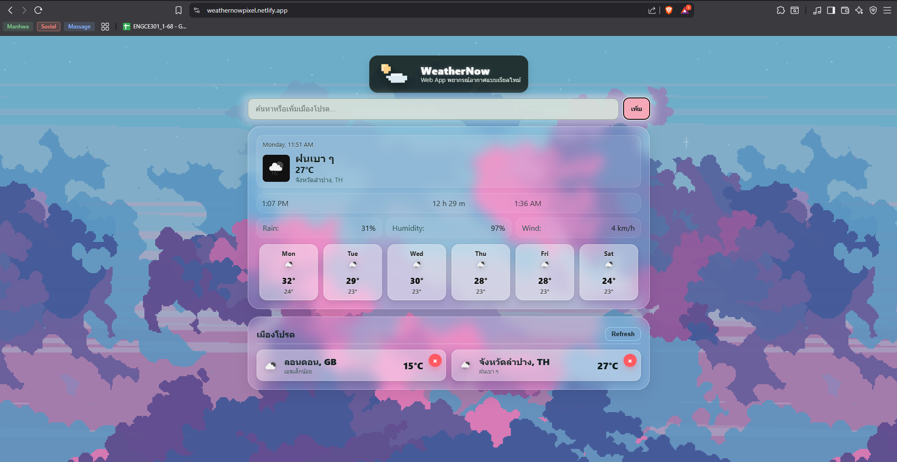

# WeatherNow — พยากรณ์อากาศสไตล์พิกเซลพาสเทล [Demo](https://weathernowpixel.netlify.app/)

เว็บแอปพยากรณ์อากาศแบบเรียลไทม์ด้วย HTML/CSS/JS ล้วน แสดงสภาพอากาศปัจจุบันและรายสัปดาห์ รองรับการเพิ่มและจัดการเมืองโปรดด้วย `localStorage` และมีฉากหลังแนวพิกเซลพาสเทลแบบ Parallax

---

- [สกรีนช็อต](#สกรีนช็อต)
- [ฟีเจอร์](#ฟีเจอร์)
- [โครงสร้างโปรเจกต์](#โครงสร้างโปรเจกต์)
- [การใช้งาน](#การใช้งาน)
- [ปรับแต่งธีมและอนิเมชัน](#ปรับแต่งธีมและอนิเมชัน)
- [สคริปต์สำคัญ](#สคริปต์สำคัญ)
- [เครดิต](#เครดิต)

---


<h2>สกรีนช็อต</h2>

<table>
  <tr>
    <td></td>
    <td></td>
  </tr>
</table>


## ฟีเจอร์

- ธีมพาสเทล + พิกเซล พร้อมโลโก้สไตล์ 8-bit
- พื้นหลังพารัลแลกซ์แบบพิกเซล (ท้องฟ้า ดาว เมฆ 2 ชั้น) ขยับช้าเพื่อไม่เวียนหัว
- การ์ดแบบ Glassmorphism อ่านง่ายบนฉากหลัง
- ค้นหาเมือง แล้ว “เพิ่มเป็นเมืองโปรด” ได้ทันที
- เก็บรายชื่อเมืองโปรดด้วย `localStorage` เปิดหน้าใหม่แล้วยังอยู่
- ปุ่มลบเมืองโปรด และปุ่ม Refresh โหลดข้อมูลเมืองโปรดทั้งหมดใหม่
- คลิกการ์ดเมืองโปรดเพื่อโหลดขึ้นการ์ดหลักอัตโนมัติ
- แสดงสภาพอากาศปัจจุบัน: ไอคอน, สภาพ, อุณหภูมิ, ชื่อเมือง/ประเทศ
- เวลาและโซนเวลาในเมืองนั้น, เวลาพระอาทิตย์ขึ้น–ตก และระยะเวลากลางวัน (Day length)
- ค่าพื้นฐาน: โอกาสฝน (POP), ความชื้น, ความเร็วลม (แปลงเป็น km/h)
- พยากรณ์รายวัน 5–7 วัน แบบการ์ดวันต่อวัน แสดงสูงสุด/ต่ำสุดและไอคอน
- ออกแบบ Responsive: มือถือไม่มีสกรอลล์แนวนอน, เดสก์ท็อปจัดเป็น Grid อัตโนมัติ
- การเข้าถึง: การ์ดเมืองโปรดกด Enter ได้, มี `aria-label` ในปุ่มสำคัญ
- ภาษาไทยทั้ง UI และคำบรรยายสภาพอากาศ
- ใช้ OpenWeather:
  - Current Weather Data API
  - 5 day / 3 hour Forecast API

### แผนผังฟีเจอร์ ↔ ไฟล์/ฟังก์ชัน

| ฟีเจอร์ | ไฟล์/ฟังก์ชันหลัก |
|---|---|
| เพิ่ม/ลบ/รีเฟรชเมืองโปรด | `script.js` → `renderFavorites()`, delegation ที่ `favContainer.addEventListener('click', …)` |
| บันทึกเมืองโปรด | `localStorage` ผ่าน `loadFavs()` และ `saveFavs()` |
| การ์ดหลัก (ปัจจุบัน + สัปดาห์) | `renderAll()`, `renderWeek()` |
| ดึงข้อมูลปัจจุบัน | `fetchCurrent(city)` |
| ดึงข้อมูลพยากรณ์ | `fetchForecast(lat, lon)` |
| พื้นหลังพิกเซลพารัลแลกซ์ | `style.css` → `.pixel-bg .sky/.stars/.clouds-mid/.clouds-front` และ keyframes |
| ธีมพาสเทล + Glassmorphism | `style.css` → `.card`, `.week .day`, `.favorites-*` |

## โครงสร้างโปรเจกต์

```text
├── assets
│   └── pixel
│       ├── bg-sky.png
│       ├── clouds-front.png
│       ├── clouds-mid.png
│       └── stars.png
├── doc
│   ├── screenshot-01.png
│   └── screenshot-02.png
├── index.html
├── script.js
└── style.css
```
## การใช้งาน

- เปิดไฟล์ `index.html` ในเบราว์เซอร์ (หรือใช้ **Live Server** ของ VS Code ก็ได้)
- พิมพ์ชื่อเมืองแล้วกด **เพิ่ม**
- การ์ดผลลัพธ์ **“สภาพอากาศปัจจุบัน + พยากรณ์สัปดาห์”** จะปรากฏ
- เมืองที่ค้นหาจะถูกบันทึกใน **“เมืองโปรด”** (LocalStorage) อัตโนมัติ
- คลิกเมืองในรายการ **“เมืองโปรด”** เพื่อโหลดข้อมูลกลับขึ้นการ์ดหลัก
- กดปุ่ม **×** ที่มุมขวาบนของการ์ดโปรดเพื่อลบออก
- ปุ่ม **Refresh** จะดึงข้อมูลล่าสุดของทุกการ์ดใน **“เมืองโปรด”**

## ปรับแต่งธีมและอนิเมชัน

### 1) สีและมิติของการ์ด (Glassmorphism)
ปรับค่าที่ `:root` เพื่อคุมธีมหลักทั้งหน้า
```css
:root{
  --bg:#b8c5b9;          /* สีพื้นหลัง */
  --text:#e7ede6;        /* สีตัวอักษรหลัก */
  --muted:#aab1a9;       /* สีตัวอักษรรอง */
  --content-width:860px; /* ความกว้างสูงสุดคอนเทนต์ */
  --input-h:46px;        /* ความสูง input/ปุ่ม */
  --radius:26px;         /* มุมโค้งการ์ด */
}
```

### 2) ความเร็วฉากหลังพิกเซล (Parallax)

ยิ่งตัวเลขมาก การเคลื่อนไหวจะ ช้าลง (ดูสบายตา)
```css
:/* ปรับความเร็วได้จากตัวแปรนี้ */
:root{
  --px-sky:   140s;  /* ท้องฟ้า */
  --px-stars: 300s;  /* ดาว */
  --px-mid:   110s;  /* เมฆชั้นกลาง */
  --px-front:  75s;  /* เมฆชั้นหน้า */
}

/* ผูกตัวแปรกับแต่ละเลเยอร์ */
.pixel-bg .sky{
  animation: move-sky var(--px-sky) linear infinite;
}
.pixel-bg .stars{
  animation:
    move-stars var(--px-stars) linear infinite,
    twinkle 3s steps(2) infinite;
}
.pixel-bg .clouds-mid{
  animation: move-mid var(--px-mid) linear infinite;
}
.pixel-bg .clouds-front{
  animation: move-front var(--px-front) linear infinite;
}
```

### 3) โหมดลดการเคลื่อนไหว (ตามระบบผู้ใช้)

ปิดแอนิเมชันอัตโนมัติเมื่อผู้ใช้ตั้งค่า “Reduce Motion”
```css
@media (prefers-reduced-motion: reduce){
  .pixel-bg .layer { animation: none !important; }
}

```

## สคริปต์สำคัญ
### เหตุการณ์หลัก (Events)
```css
// ค้นหา/เพิ่มเมืองโปรด
searchForm.addEventListener('submit', async (e) => {
  e.preventDefault();
  const city = cityInput.value.trim();
  if(!city) return setStatus('กรุณาป้อนชื่อเมือง');
  setStatus('กำลังโหลดข้อมูล...');
  await renderAll(city);
  weatherCard.classList.remove('hidden');

  // เพิ่มเป็นรายการโปรด (กันซ้ำ)
  const favs = loadFavs();
  if(!favs.map(n=>n.toLowerCase()).includes(city.toLowerCase())){
    favs.push(city); saveFavs(favs); await renderFavorites();
  }
  favWrap.classList.remove('hidden'); setStatus(''); cityInput.value='';
});

// รีเฟรชข้อมูลเมืองโปรดทั้งหมด
refreshBtn.addEventListener('click', async () => {
  setStatus('รีเฟรชข้อมูลเมืองโปรด...'); await renderFavorites(); setStatus('');
});

// Delegation: ลบ/เปิดการ์ดโปรด
favContainer.addEventListener('click', async (e) => {
  const removeBtn = e.target.closest('button.fav-remove');
  if(removeBtn){
    e.stopPropagation();
    const name = removeBtn.dataset.remove;
    saveFavs(loadFavs().filter(c => c.toLowerCase() !== name.toLowerCase()));
    return renderFavorites();
  }
  const card = e.target.closest('.fav-card');
  if(card){
    const city = card.dataset.city || card.querySelector('.fav-city')?.textContent?.trim();
    if(!city) return;
    setStatus(`กำลังโหลดข้อมูลของ ${city} ...`);
    await renderAll(city);
    weatherCard.classList.remove('hidden');
    setStatus('');
  }
});

// รองรับกด Enter บนการ์ดโปรด
favContainer.addEventListener('keydown', async (e) => {
  if(e.key !== 'Enter') return;
  const card = e.target.closest('.fav-card');
  const city = card?.dataset.city || card?.querySelector('.fav-city')?.textContent?.trim();
  if(!city) return;
  setStatus(`กำลังโหลดข้อมูลของ ${city} ...`);
  await renderAll(city);
  weatherCard.classList.remove('hidden');
  setStatus('');
});
```

### LocalStorage (เก็บรายชื่อเมืองโปรด)
```css
const LS_KEY = 'we-now:favorites';
const loadFavs = () => JSON.parse(localStorage.getItem(LS_KEY) || '[]');
const saveFavs = (arr) => localStorage.setItem(LS_KEY, JSON.stringify(arr));
```

### ดึงข้อมูลจาก OpenWeather
```css
// สภาพอากาศปัจจุบัน
async function fetchCurrent(city){
  const url = `https://api.openweathermap.org/data/2.5/weather?q=${
    encodeURIComponent(city)}&appid=${apiKey}&units=metric&lang=th`;
  const res = await fetch(url);
  if(!res.ok) throw new Error('ไม่พบข้อมูลเมืองนี้');
  return res.json();
}

// พยากรณ์ 5 วัน (ระยะ 3 ชม.)
async function fetchForecast(lat, lon){
  const url = `https://api.openweathermap.org/data/2.5/forecast?lat=${lat}&lon=${lon}&appid=${apiKey}&units=metric&lang=th`;
  const res = await fetch(url);
  if(!res.ok) throw new Error('ดึงข้อมูลพยากรณ์ไม่ได้');
  return res.json();
}
```

### LocalStorage (เก็บรายชื่อเมืองโปรด)
```css
async function renderAll(city){
  const cur = await fetchCurrent(city);
  const fc  = await fetchForecast(cur.coord.lat, cur.coord.lon);

  // เวลา/คำอธิบาย/อุณหภูมิ/ชื่อเมือง
  const tz = fc.city.timezone ?? 0;
  refs.when.textContent = toLocalDateTime(Date.now(), tz);
  refs.desc.textContent  = capFirst(cur.weather?.[0]?.description || '—');
  refs.temp.textContent  = `${Math.round(cur.main.temp)}°C`;
  refs.place.textContent = `${cur.name}${cur.sys?.country ? ', ' + cur.sys.country : ''}`;
  refs.icon.src = `https://openweathermap.org/img/wn/${cur.weather?.[0]?.icon}@2x.png`;

  // ดวงอาทิตย์
  const sr = cur.sys.sunrise * 1000, ss = cur.sys.sunset * 1000;
  refs.sunrise.textContent   = toLocalTime(sr, tz);
  refs.sunset.textContent    = toLocalTime(ss, tz);
  refs.dayLength.textContent = humanizeDuration(ss - sr);

  // Metrics
  const next = fc.list[0];
  refs.rain.textContent     = `${Math.round((next?.pop ?? 0) * 100)}%`;
  refs.humidity.textContent = `${cur.main.humidity}%`;
  refs.wind.textContent     = `${Math.round(cur.wind.speed * 3.6)} km/h`;

  // สัปดาห์
  renderWeek(fc);
}

```

### Utilities ที่ใช้บ่อย
```css
function setStatus(msg){ statusBox.textContent = msg || ''; }
function capFirst(s){ return (s||'').slice(0,1).toUpperCase() + (s||'').slice(1); }
function toLocalTime(ms, tz){ return new Date(ms + tz*1000).toLocaleTimeString([], {hour:'numeric', minute:'2-digit'}); }
function toLocalDateTime(ms, tz){
  const d = new Date(ms + tz*1000);
  const day = d.toLocaleDateString('en-GB', { weekday:'long' });
  const tm  = d.toLocaleTimeString([], { hour:'2-digit', minute:'2-digit' });
  return `${day}, ${tm}`;
}
function toLocalDate(ms, tz){
  const d=new Date(ms + tz*1000);
  return `${d.getUTCFullYear()}-${String(d.getUTCMonth()+1).padStart(2,'0')}-${String(d.getUTCDate()).padStart(2,'0')}`;
}
function dayName(dateStr){ return new Date(dateStr+'T00:00:00Z').toLocaleDateString('en-GB',{weekday:'short'}); }
function humanizeDuration(ms){ const m=Math.round(ms/60000); const h=Math.floor(m/60), mm=m%60; return `${h} h ${mm} m`; }
function pickAroundHour(arr,h){
  let best=null, diff=1e9;
  for(const it of arr){ const d=Math.abs(new Date(it.dt*1000).getUTCHours()-h); if(d<diff){ diff=d; best=it; } }
  return best;
}

```
## เครดิต

- ข้อมูลสภาพอากาศ: OpenWeather [click](https://openweathermap.org/api)

- ภาพฉากหลังพิกเซล: ชุดภาพ “free sky with clouds – pixel art set” [click](https://youtu.be/sP1XpC2svJg)

- แนวทางออกแบบ: Pastel + Glassmorphism + Pixel UI

- ฟอนต์ที่ใช้: Inter (ระบบ/เว็บฟอนต์), Press Start 2P (ตัวอักษรพิกเซลของโลโก้ – ถ้าใช้งานให้เพิ่มจาก Google Fonts)


