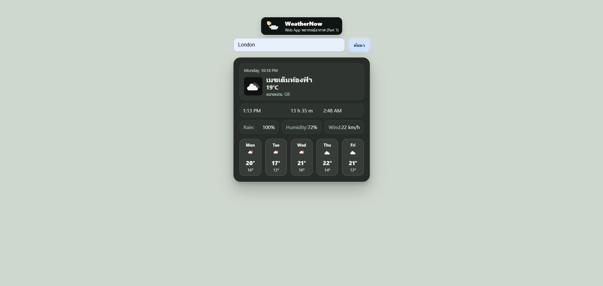

# WeatherNow — พยากรณ์อากาศ (Part 1) [Demo](https://weathernowpixel.netlify.app/)

เว็บแอปพยากรณ์อากาศแบบเรียลไทม์ด้วย **HTML/CSS/JS** ล้วน แสดง **สภาพอากาศปัจจุบัน** พร้อม **พยากรณ์รายสัปดาห์** 

---

- [สกรีนช็อต](#สกรีนช็อต)
- [ฟีเจอร์](#ฟีเจอร์)
- [โครงสร้างโปรเจกต์](#โครงสร้างโปรเจกต์)
- [การใช้งาน](#การใช้งาน)
- [ปรับแต่งธีมและอนิเมชัน](#ปรับแต่งธีมและอนิเมชัน)
- [สคริปต์สำคัญ](#สคริปต์สำคัญ)

---

## สกรีนช็อต

<table>
  <tr>
    <td></td>
    <td></td>
  </tr>
</table>

---

## ฟีเจอร์

- ธีม **พาสเทล + พิกเซล** พร้อมโลโก้สไตล์ 8-bit
- การ์ดผลลัพธ์แบบ **Glassmorphism** อ่านง่ายบนฉากหลังโทนพาสเทล
- ค้นหาเมือง → แสดงผล **สภาพอากาศปัจจุบัน**
  - ไอคอน/คำบรรยายสภาพอากาศ (ภาษาไทย), อุณหภูมิ, เมือง/ประเทศ
  - เวลาในเมืองนั้น, เวลา **พระอาทิตย์ขึ้น–ตก** และ **ความยาวช่วงกลางวัน**
  - ค่าพื้นฐาน: โอกาสฝน (POP), ความชื้น, ความเร็วลม (แปลงเป็น km/h)
- **พยากรณ์รายสัปดาห์ (5–7 วัน)** แสดงอุณหภูมิสูงสุด/ต่ำสุด + ไอคอนรายวัน
- ใช้ข้อมูลจาก **OpenWeather**
  - Current Weather Data API
  - 5 day / 3 hour Forecast API

---

## โครงสร้างโปรเจกต์

```text
├── doc
│   ├── Screenshot02.png
│   └── Screenshot01.png
├── index.html
├── readme.md
├── script.js
└── style.css
```

## การใช้งาน

- เปิดไฟล์ index.html ในเบราว์เซอร์ (หรือใช้ Live Server ของ VS Code ก็ได้)
- พิมพ์ชื่อเมืองแล้วกด เพิ่ม
- การ์ดผลลัพธ์ “สภาพอากาศปัจจุบัน + พยากรณ์สัปดาห์” จะปรากฏ
- เมืองที่ค้นหาจะถูกบันทึกใน “เมืองโปรด” (LocalStorage) อัตโนมัติ

## ปรับแต่งธีมและอนิเมชัน

### 1) ธีมหลัก + มิติของการ์ด (Glassmorphism)
แก้ไขที่ :root เพื่อคุมโทนสีและมิติโดยรวมของหน้า
```css
:root{
  --bg:#b8c5b9;          /* สีพื้นหลัง */
  --text:#e7ede6;        /* สีตัวอักษรหลัก */
  --muted:#aab1a9;       /* สีตัวอักษรรอง */
  --content-width:860px; /* ความกว้างสูงสุดคอนเทนต์ */
  --input-h:46px;        /* ความสูง input/ปุ่ม */
  --radius:26px;         /* มุมโค้งการ์ด */
}
```
การ์ด (ผลลัพธ์หลัก/สรุปค่า/สัปดาห์) – เพิ่ม/ลดความโปร่ง, เงา, และมุมโค้ง
```css
.card{
  background: rgba(255,255,255,.18);     /* ความโปร่ง */
  border: 1px solid rgba(255,255,255,.36);
  border-radius: var(--radius);
  box-shadow: 0 10px 30px rgba(3,10,12,.08);
  backdrop-filter: blur(12px) saturate(120%);
  -webkit-backdrop-filter: blur(12px) saturate(120%);
}
```
### 2) ช่องค้นหาและปุ่ม
ปรับให้เข้าธีม/อ่านง่ายขึ้น
```css
.search input{
  height: var(--input-h);
  border-radius: 12px;
  border: 1px solid rgba(142,160,147,.9);
  background: rgba(215,225,216,.85);
  color: #051923;
}
.search button{
  height: var(--input-h);
  border-radius: 12px;
  background:#A0D8EF; /* โทนพาสเทลฟ้า */
  color:#051923;
  font-weight:700;
}
.search button:hover{ background:#F5A9B8; } /* พาสเทลชมพูเมื่อโฮเวอร์ */
```
### 3) กริดพยากรณ์รายสัปดาห์
กำหนดขนาดการ์ดวัน/ตัวอักษรให้เหมาะกับจอ
```css
.week{
  display:grid;
  grid-template-columns:repeat(auto-fit,minmax(120px,1fr));
  gap:12px;
}
.day{
  height:120px;           /* ลด/เพิ่มได้ตามต้องการ */
  border-radius:16px;
  background:rgba(255,255,255,.28);
  border:1px solid rgba(255,255,255,.40);
}
.day .name{ font-size:13px; font-weight:700; }
.day .max{  font-size:18px; font-weight:800; }
.day .min{  font-size:13px; font-weight:600; }
```
## โลโก้พิกเซล (Pixel Logo)

<p align="center">
  <!-- SVG เรนเดอร์จริงใน README -->
  <svg width="160" viewBox="0 0 16 12" xmlns="http://www.w3.org/2000/svg" shape-rendering="crispEdges">
    <!-- highlight -->
    <rect x="2" y="2" width="1" height="1" fill="#FFE9A8"/>
    <rect x="3" y="2" width="1" height="1" fill="#FFE9A8"/>
    <rect x="4" y="2" width="1" height="1" fill="#FFD085"/>
    <!-- top body -->
    <rect x="2" y="3" width="1" height="1" fill="#FFE3BA"/>
    <rect x="3" y="3" width="1" height="1" fill="#FFD085"/>
    <rect x="4" y="3" width="1" height="1" fill="#FFD085"/>
    <rect x="5" y="3" width="1" height="1" fill="#FFD085"/>
    <!-- mid body -->
    <rect x="2" y="4" width="1" height="1" fill="#FFE3BA"/>
    <rect x="3" y="4" width="1" height="1" fill="#FFD085"/>
    <rect x="4" y="4" width="1" height="1" fill="#FFD085"/>
    <rect x="5" y="4" width="1" height="1" fill="#FFD085"/>
    <rect x="3" y="5" width="1" height="1" fill="#FFD085"/>
    <rect x="4" y="5" width="1" height="1" fill="#FFD085"/>
    <!-- cloud white -->
    <rect x="6" y="6" width="1" height="1" fill="#F4FAFF"/>
    <rect x="7" y="6" width="1" height="1" fill="#F4FAFF"/>
    <rect x="8" y="6" width="1" height="1" fill="#F4FAFF"/>
    <rect x="9" y="6" width="1" height="1" fill="#F4FAFF"/>
    <rect x="10" y="6" width="1" height="1" fill="#F4FAFF"/>
    <rect x="4" y="7" width="1" height="1" fill="#DCEAF1"/>
    <rect x="5" y="7" width="1" height="1" fill="#DCEAF1"/>
    <rect x="6" y="7" width="1" height="1" fill="#DCEAF1"/>
    <rect x="7" y="7" width="1" height="1" fill="#DCEAF1"/>
    <rect x="8" y="7" width="1" height="1" fill="#DCEAF1"/>
    <rect x="9" y="7" width="1" height="1" fill="#DCEAF1"/>
    <rect x="10" y="7" width="1" height="1" fill="#DCEAF1"/>
    <rect x="11" y="7" width="1" height="1" fill="#DCEAF1"/>
    <rect x="12" y="7" width="1" height="1" fill="#DCEAF1"/>
    <rect x="5" y="8" width="1" height="1" fill="#DCEAF1"/>
    <rect x="6" y="8" width="1" height="1" fill="#DCEAF1"/>
    <rect x="7" y="8" width="1" height="1" fill="#DCEAF1"/>
    <rect x="8" y="8" width="1" height="1" fill="#DCEAF1"/>
    <rect x="9" y="8" width="1" height="1" fill="#DCEAF1"/>
    <rect x="10" y="8" width="1" height="1" fill="#DCEAF1"/>
    <rect x="11" y="8" width="1" height="1" fill="#DCEAF1"/>
    <rect x="12" y="8" width="1" height="1" fill="#DCEAF1"/>
    <rect x="6" y="9" width="1" height="1" fill="#DCEAF1"/>
    <rect x="7" y="9" width="1" height="1" fill="#DCEAF1"/>
    <rect x="8" y="9" width="1" height="1" fill="#DCEAF1"/>
    <rect x="9" y="9" width="1" height="1" fill="#DCEAF1"/>
    <rect x="10" y="9" width="1" height="1" fill="#DCEAF1"/>
    <rect x="11" y="9" width="1" height="1" fill="#DCEAF1"/>
  </svg>
</p>

<details>
  <summary><strong>ดูโค้ด SVG</strong></summary>

```html
<!-- คัดลอก SVG ทั้งก้อนนี้ไปใช้ได้เลย -->
<svg viewBox="0 0 16 12" xmlns="http://www.w3.org/2000/svg" shape-rendering="crispEdges">
  <!-- (เนื้อหา rect ทั้งหมดตามที่เรนเดอร์ด้านบน) -->
</svg>
</details>

HTML (วางตรง <header> หรือบนสุดของหน้า):
## สคริปต์สำคัญ
### 1) เหตุการณ์หลัก (ค้นหาเมือง)
```javascript
const apiKey = 'YOUR_API_KEY_HERE';
const searchForm = document.querySelector('#search-form');
const cityInput  = document.querySelector('#city-input');

searchForm.addEventListener('submit', (e) => {
  e.preventDefault();
  const city = cityInput.value.trim();
  if (!city) return alert('กรุณาป้อนชื่อเมือง');
  getWeather(city); // ดึงและแสดงผล
});
```

### 2) ดึงข้อมูลจาก OpenWeather (ปัจจุบัน)
```javascript
async function getWeather(city) {
  const url = `https://api.openweathermap.org/data/2.5/weather?q=${
    encodeURIComponent(city)}&appid=${apiKey}&units=metric&lang=th`;

  const res = await fetch(url);
  if (!res.ok) throw new Error('ไม่พบข้อมูลเมืองนี้');

  const data = await res.json();
  displayWeather(data);     // วาดผลปัจจุบัน
  // ดึงพยากรณ์ต่อ แล้วสรุปเป็นรายสัปดาห์:
  const fc = await getForecast(data.coord.lat, data.coord.lon);
  renderWeek(fc);
}
```
### 3) พยากรณ์ 5 วัน (ช่วงละ 3 ชม.) → สรุปเป็นรายวัน
```javascript
async function getForecast(lat, lon){
  const url = `https://api.openweathermap.org/data/2.5/forecast?lat=${lat}&lon=${lon}&appid=${apiKey}&units=metric&lang=th`;
  const res = await fetch(url);
  if(!res.ok) throw new Error('ดึงข้อมูลพยากรณ์ไม่ได้');
  return res.json();
}
```
### 4) แสดงผลปัจจุบัน (ย่อ)
```javascript
function displayWeather(data){
  const { name, sys, main, weather } = data;
  // อัปเดต DOM → ชื่อเมือง/ประเทศ, ไอคอน, คำบรรยาย (th), อุณหภูมิ, sunrise/sunset/day length ฯลฯ
}
```


